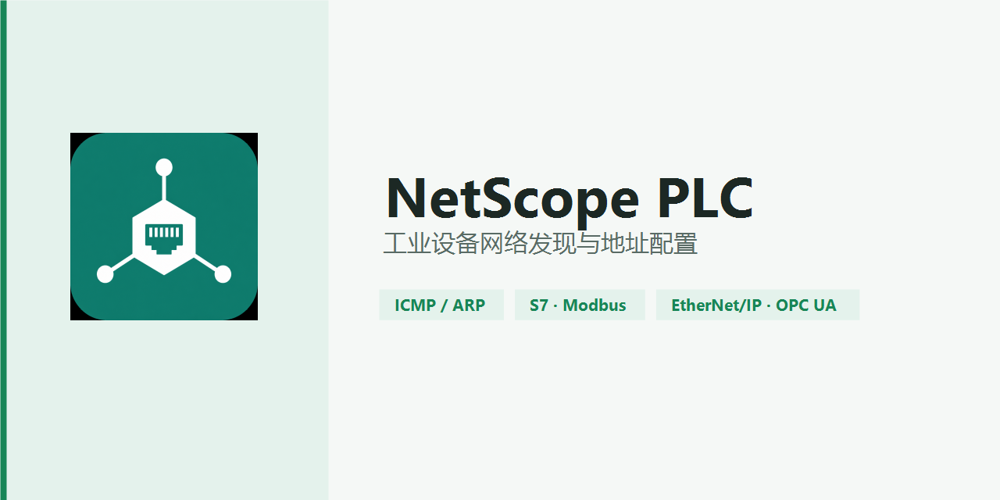

<p align="center">
  
</p>

<p align="center">
  <strong>工业设备网络发现与地址配置</strong><br>
  Windows 本机工具：WPF 界面 + 原生 ICMP/ARP 扫描核心，快速发现并识别现场 PLC / 工控设备。
</p>

<p align="center">
  
  
  
  
  
</p>

<p align="center">
  <a href="CODE_OF_CONDUCT.md">Code of Conduct</a> ·
  <a href="CONTRIBUTING.md">Contributing</a> ·
  <a href="SECURITY.md">Security</a> ·
  <a href="CONTRIBUTORS.md">Contributors</a> ·
  <a href="LICENSE">License</a>
</p>

---

## 能做什么

| 能力 | 说明 |
|------|------|
| 网卡枚举 | 列出本机接口；未配置 IPv4 的网卡也会显示，不会被静默过滤 |
| 三种扫描 | 本网段 · 常见内网段 · 手工 CIDR |
| 临时改址 | 扫未知网段时临时设 IP，结束后自动恢复静态地址或 DHCP |
| 双通道发现 | ICMP 应答 + 所选接口 ARP 邻居；不 Ping 但回 ARP 的设备也能进结果 |
| 协议识别 | 反向 DNS，以及 S7 / Modbus / EtherNet/IP / OPC UA 端口指纹 |
| 现场改址 | 选中设备后一键把本机配到同网段，或恢复 DHCP |
| 扫描控制 | 暂停 / 继续 / 停止 |

## 协议指纹

| 协议 | 端口 |
|------|------|
| Siemens S7 / ISO-TSAP | `102` |
| Modbus TCP | `502` |
| EtherNet/IP | `44818` |
| OPC UA | `4840` |

## 架构

```
NetScopePLC.exe          WPF 界面 · 网卡 / 扫描编排 · netsh 改址 · 协议识别
        │
        ▼  stdout 协议（UTF-8，制表符分隔）
NetScopeNative.exe       C 核心 · 绑定源地址 ICMP · ARP 邻居导出
```

原生进程输出约定：

```text
HOST    <ip>    <rtt>
ARP     <ip>    <mac>
DONE    <scanned>    <replied>
```

## 运行

1. **以管理员运行** `NetScopePLC.exe`（清单会触发 UAC）
2. `NetScopePLC.exe` 与 `NetScopeNative.exe` **必须在同一目录**

仓库根目录已带构建用的 `NetScopeNative.exe`。完整自包含单文件包请本地执行 `build.bat`，产物在 `publish/`。

## 构建

```bat
build.bat
```

依赖：

- Visual Studio 18 Enterprise（C++ 工具链，`vcvars64`）
- .NET 10 SDK

发布形态：`net10.0-windows` 自包含单文件；运行时两个 EXE 同目录，改 IP 需要管理员权限。

## 注意

- 临时改址期间网络会短暂中断；未知网段扫描结束后会在 `finally` 中恢复原配置。
- 仅禁用 ICMP 且不回应 ARP 的设备可能扫不到，需再加对应厂商协议探测。
- 仅在你有权管理的网络上使用。

## 技术栈

- **UI**：C# / WPF（`MainWindow.xaml(.cs)`、`App.xaml(.cs)`）
- **扫描核心**：C（`netscope_native.c` → `NetScopeNative.exe`，iphlpapi + winsock）
- **构建**：`build.bat`（`vcvars64` + `dotnet publish`）
